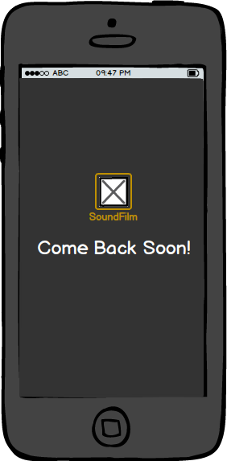
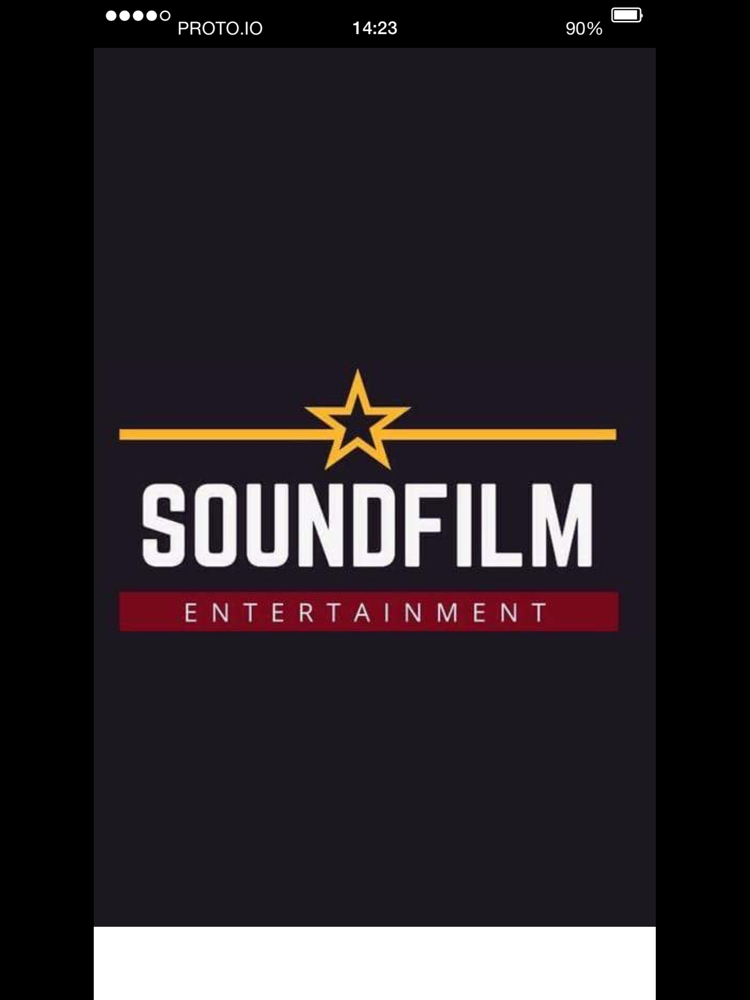

# SOUNDFILM
* **Track:** _Common Core_
* **Sprint 03:**  _Hackaton_
* **Unidad:** _04_

## Objetivo
Crear una aplicación que le brinde usuario la oportunidad de formar colecciones sobre películas mostrando sus posters y soundtrack list.

## Requisitos.

* Mobile Friendly
* Pantalla de inicio de sesión
* Pantalla de registro
* Perfil de usuario
* Menu general
* Catalogo de películas
* Opción para agregar a lista personal
* Ficha con poster, info y modal con soundtrack list
* Pantalla de salida

## Flujo de trabajo

1. Definir tema y objetivo de negocio.

2. Establecer rutas de trabajo y medios de comunicación en el equipo.

3. Investigación de herramientas a utilizar para el desarrollo de la idea.

4. Detección de desafios a resolver(funcionalidad) y selección de herramientas.

5. Sketch del diseño.

6. Establecer estructura de carpetas con los archivos necesarios para el proyecto.

7. Escribir pseudo código para identificar funcionalidad requerida (backlog) estableciendo prioridades de cada función:

				* Indispensables	Prioridad 1
				* Medias			Prioridad 2
				* Prescindibles     Prioridad 3
				* Extras 		   Prioridad 4

8. Realizar el marcado del contenido en un archivo html.

9. Desarrollar funcionalidad.

10. Prototipo.

11. Establecer estilos en archivo css.

12. Aplicar los principios de diseño responsive.

13. Realizar primera prueba.

14. Realizar mejoras y modificaciones en relación a los resultados de la prueba.

15. Realizar segunda prueba.

16. Ajustes finales.

17. Subir a repositorio Git y crear GHpage correspondiente.

18. Condensar información y realizar presentación.

## Consideraciones

* En la carpeta docs se puede encontrar la siguiente información:

        UX:       Infografía.
                  Sketches.
                  Wireframes.
        UI:       Style Guide.
        Frontend: Backlog.   
                  Pseudocódigo.

## Sketches

* Splash

* Home

* Home Modal Signup

* Home Modal Login

* Genres Carrousel

* Genres Catalog

* Movie Info Card

* Soundtrack List

* User Lists

* Logout

## Wireframes

* Splash Screen

* Home

* Home Modal Signup

* Home Modal Login

* Genres Carrousel

* Genres Catalog

* Movie Info

* Soundtrack de película

* User Profile

* User Lists

* Menu

## Prototype
[https://share.proto.io/N4HPL2/]

## Style Guide

